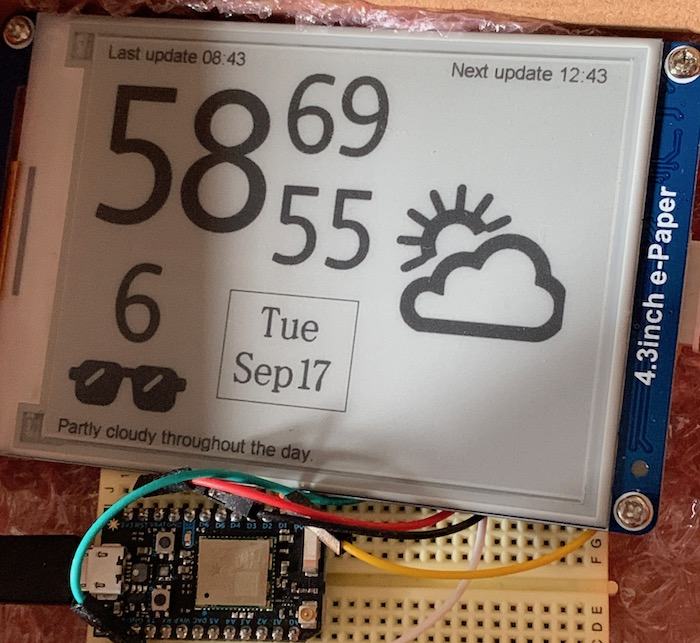

e-ink weather display

It works, but *please* don't follow this as an example. Practically every decision I made is the wrong one.

* The e-ink display I chose is awful. The API is basically "draw a pixel or a square or a circle" and that's it. You can also draw a bitmap *that's already stored on the device*, but you can't upload one over the wire. The built in fonts are awful, so I did all the text rendering by displaying saved bitmaps.

* The Dark Sky API shut down at the end of 2022; I now use [Pirate Weather](https://pirateweather.net/en/latest/)
    * **IMPORTANT** The Pip-distributed darksky-weather doesn't work with pirateweather - pirateweather changed the API. The Dockerfile uses forecast.patch to make the needed change.

* It's not standalone. The actual weather-fetching happens on a separate server; the display wakes up every hour, says "hey gimme weather", and then the server does a push back to the [Particle](https://www.particle.io/).

* The case is ugly. I 3D-printed it because I couldn't find any decent cases that would hold the display I chose.

Build with: `docker build --build-arg PARTICLE_TOKEN=your_particle_token -t wxpaper .` You'll probably want to use an unexpiring token.

icons from https://www.iconsdb.com/black-icons/black-weather-icons.html

